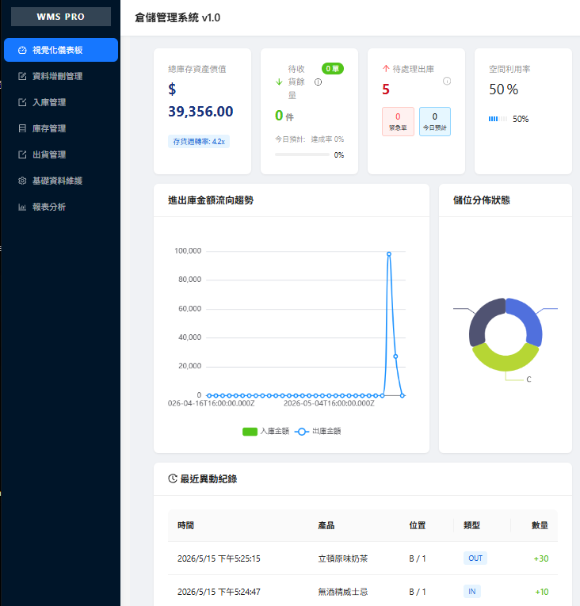
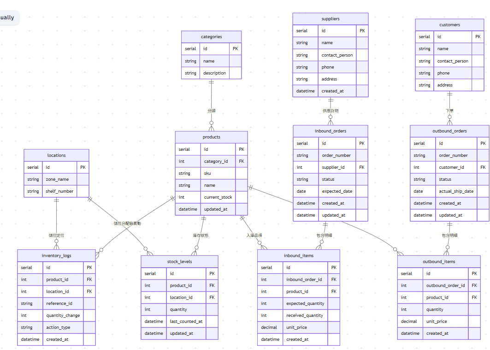

# 啟動前端
`cd /front_end && npm run dev`

# 啟動後端
`cd /back_end && node server_kenx.js`

<hr style="height: 5px; background-color: #000000; border: none;">

## 專案檔案樹狀圖

### 📂 專案架構目錄

```bash
根目錄/
├── /back_end                 # 後端專案資料夾
│   ├── /db                   # 資料庫配置
│   │   └── index_kenx.js     # Knex 連線與資料庫初始化設定
│   ├── /node_modules         # 後端第三方相依套件庫
│   ├── /routes               # 路由模組資料夾
│   │   └── crudFactory.js... # 通用 CRUD 動態路由產生器（及其他各 API 路由）
│   ├── .env                  # 後端環境變數隱私設定檔（資料庫密碼、Port 等）
│   ├── package-lock.json     # 後端套件鎖定檔
│   ├── package.json          # 後端專案核心設定與 dependencies 清單
│   └── server_knex.js        # 後端 Express 伺服器主進入點
│
├── /front_end                # 前端專案資料夾 (Vite + React)
│   ├── /node_modules         # 前端第三方相依套件庫
│   ├── /public               # 靜態資源資料夾（不需經 Vite 編譯的檔案）
│   ├── /src                  # 前端核心原始碼
│   │   ├── /assets           # 多媒體資源（圖片、圖示等）
│   │   ├── /component        # React 頁面組件資料夾
│   │   │   └── crud.jsx...   # 通用資料增刪管理組件（及其他各畫面組件）
│   │   ├── App.css           # 全域應用程式樣式
│   │   ├── App.jsx           # 前端根組件（配置主要路由與視窗架構）
│   │   ├── main.css          # 主要入口樣式
│   │   ├── main.jsx          # 前端程式進入點（ReactDOM 渲染位置）
│   │   └── index.css         # 基礎全域樣式
│   ├── index.html            # 前端單頁應用程式 (SPA) 主網頁
│   ├── vite.config.js        # Vite 建置工具設定檔
│   ├── eslint.config.js      # ESLint 程式碼檢查規範設定
│   ├── package-lock.json     # 前端套件鎖定檔
│   └── package.json          # 前端專案核心設定與套件清單
│
└── /Document                 # 專案相關說明文件與規格書資料夾

```

<hr style="height: 5px; background-color: #000000; border: none;">

## 版面配置



`APP.jsx` 所引用的主要組件、檔案路徑與功能說明。

| 物件名稱 | 檔案路徑 | 功能說明 |
| :--- | :--- | :--- |
| **Dashboard** | `./component/dashboard.jsx` | 視覺化儀表板 |
| **UniversalCRUD** | `./component/crud.jsx` | 資料增刪管理 |
| **InboundManager2** | `./component/inbound2.jsx` | 入庫管理 |
| **Manager** | `./component/Manager.jsx` | 庫存管理 |
| **OutboundManager** | `./component/outbound.jsx` | 出貨管理 |
| **null** | `null` | 基礎資料維護空置待做 |
| **AnalyzePage** | `./component/analyze.jsx` | 報表分析 |


<hr style="height: 5px; background-color: #000000; border: none;">

## 資料庫Diagram


## 資料表關聯總覽

* **1. `categories` — 商品分類**：用於對商品進行分類管理，每個商品必須屬於一個分類（一對多關係）。
* **2. `products` — 商品**：`current_stock` 為快取欄位，記錄目前的總庫存量，方便快速查詢，實際明細由 `stock_levels` 管理。
* **3. `locations` — 倉儲位置**：用於定義倉庫中的實體位置，一個商品可存放於多個位置（透過 `stock_levels` 關聯）。
* **4. `stock_levels` — 各位置庫存水位**：唯一索引待完成。
* **5. `inventory_logs` — 庫存異動日誌**：`reference_id` 可對應入庫單或出庫單號。
* **6. `suppliers` — 供應商**：存放供應商基本資料，一個供應商可對應多筆採購入庫訂單。
* **7. `inbound_orders` — 採購入庫訂單**：一張採購訂單，一張訂單可包含多個商品明細（`inbound_items`）。
* **8. `inbound_items` — 採購入庫明細**：`expected_quantity` 與 `received_quantity` 可用於對帳，若兩者不符代表有短缺或多收。
* **9. `customers` — 客戶**：存放客戶基本資料，與 `outbound_orders` 為一對多關係。
* **10. `outbound_orders` — 銷售出庫訂單**：一張銷售出貨訂單，一張訂單可包含多個商品明細（`outbound_items`）。
* **11. `outbound_items` — 銷售出庫明細**：記錄每張出庫訂單中各商品的出庫數量與單價，可用於計算銷售金額。


---

## 資料庫Diagram

| 關聯 | 說明 |
|------|------|
| `categories` → `products` | 一對多：一個分類包含多個商品 |
| `products` → `stock_levels` | 一對多：一個商品有多個位置的庫存 |
| `locations` → `stock_levels` | 一對多：一個位置可放多種商品 |
| `products` → `inventory_logs` | 一對多：一個商品有多筆庫存異動記錄 |
| `locations` → `inventory_logs` | 一對多：一個位置有多筆庫存異動記錄 |
| `suppliers` → `inbound_orders` | 一對多：一個供應商有多張採購訂單 |
| `inbound_orders` → `inbound_items` | 一對多：一張訂單有多筆明細 |
| `products` → `inbound_items` | 一對多：一個商品出現在多張採購明細 |
| `customers` → `outbound_orders` | 一對多：一個客戶有多張出庫訂單 |
| `outbound_orders` → `outbound_items` | 一對多：一張訂單有多筆明細 |
| `products` → `outbound_items` | 一對多：一個商品出現在多張出庫明細 |


